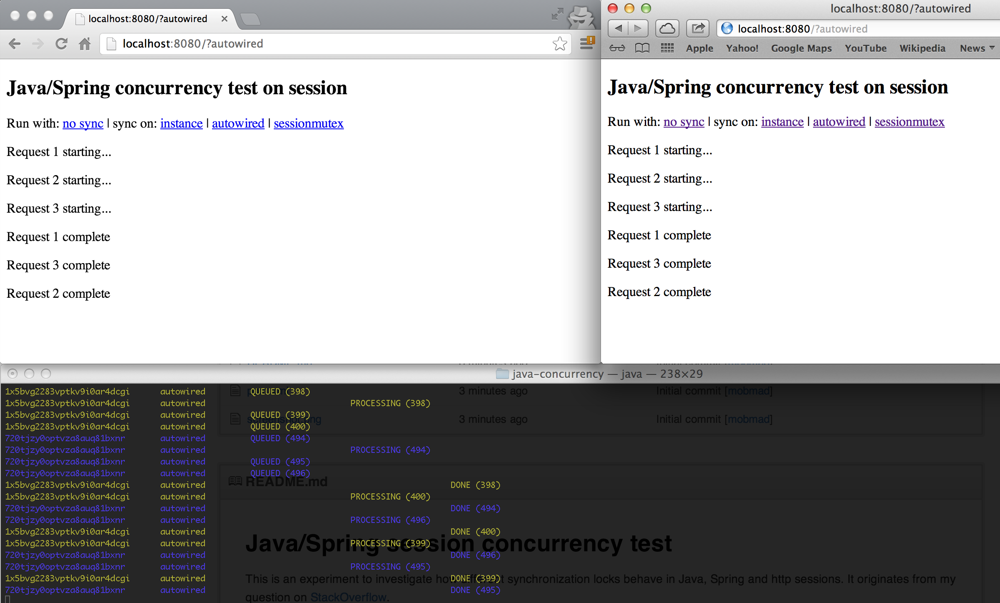

# Java/Spring session concurrency test

This is an experiment to investigate how different synchronization locks behave in Java, Spring and http sessions.
It originates from my question on [StackOverflow](http://stackoverflow.com/questions/14890348/syncronizing-on-a-instance-variable-in-a-session-scoped-spring-bean-to-limit-con).

It simulates an application where each user fires multiple ajaxrequests in parallell to
the [SlowLegacyCarRepository](src/main/java/no/mobmad/SlowLegacyCarRepository.java). The SlowLegacyCarRepository can
only handle one concurrent request pr. user, hence the need to either:

* queue all ajax-requests on the client (not discussed further here). If ***most parts*** of your backend doesn't handle concurrent requests for some reason, this
might be a better approach than to synchronize on the server-side (see below).
* On the other hand, you might have a backend where most of the ajax-requests ***can*** run in parallell and queueing all
 ajax-requests seems like a sledgehammer solution. Instead you consider synchronizing the problematic requests, so that a maximum
 of one concurrent request hits the legacy service pr. session (user). ***Warning*** requests will be blocked (put on hold)
 until the legacy service returns and let another request in. This ***might*** be a problem if the clientside application
 should fire R requests pr user and U users are doing this at the same time. [FEEDBACK/MORE RESEARCH NEEDED]

Synchronization should also work in a clustered environment, as long as sticky sessions are enabled, forwarding each
 session to the same app server/JVM. [FEEDBACK NEEDED]

## Run instructions

1. `mvn jetty:run`
2. Fire up at least two browsers and tile windows for the best experience.
3. Click on:
    * ***no sync*** for no synchronization. The "backend service" will process multiple requests from the same user simultaneously
    * ***instance*** for synchronization on a instancevariable inside a session scoped Spring bean
    * ***autowired*** for synchronization on an autowired requestscoped instancevariable inside a session scoped Spring bean
    * ***sessionmutex*** for synchronization on a HttpSession attribute with Spring's WebUtils.getSessionMutex

Each run pr. browser (simulated user) is given a new HttpSession. Session will be logged with different colors for
 your viewing pleasure. The number behind the status, e.g. QUEUED (716) identifies requests pr. session in order to
 trace them easier.

## Preliminary results
Instance/autowired/sessionmutex all seem to work the same and as intended [MORE RESEARCH NEEDED]

## Configuration
Adjust the number of simultaneous requests and response time in [index.jsp](src/main/webapp/index.jsp)

## Contributions
Feedback and pull requests are most welcome :-)
